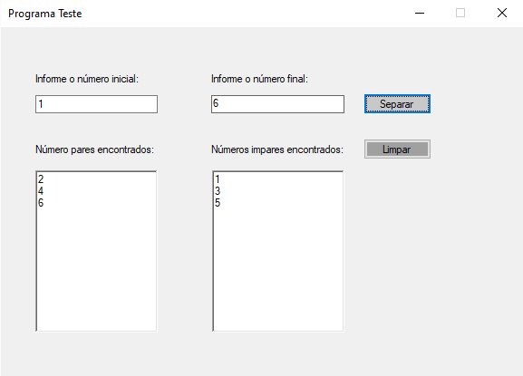
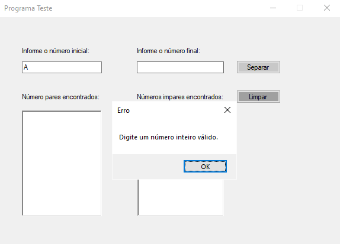
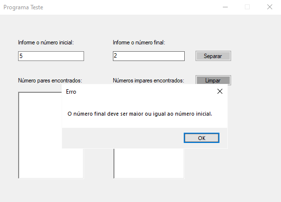

<h1 align="center">Teste em C#</h1>
<p>Esta é uma simples aplicação desktop, feita com ojetivo de praticar conceitos de programação e ter um primeiro contato com a linguagem de programação C#.</p>

## 🌐 Como Usar

Baixe a versão compilada [aqui](teste/bin/Debug/teste.exe?raw=true)<br>
_(Execute como administrador)_

**Ou siga os passos a seguir:**
1. Clone este repositório para o seu computador usando:<br>
   ```git clone https://github.com/KarlosEKaminski/testando-CSharp.git```
3. Abra o projeto em sua IDE favorita.
4. Compile e execute o código.
5. Siga as instruções na interface gráfica para utilização.

## 📦 Recursos

- Disponível apenas em PT-BR.
- Interface gráfica simples e intuitiva.

## 🛠 Funcionalidades

- Ao digitar um número inteiro inicial e um número inteiro final, o programa irá organizar o intervalo entre os números digitados separando em números pares e ímpares
- Ao digitar letras ao invés de números inteiros, o programa irá exibir uma mensagem de erro.
- Ao digitar um número inteiro final que seja menor que o número inicial digitado, o programa irá exibir uma mensagem de erro.

## ⚙ Requisitos
- Sistema operacional Windows
- .NET Framework

## 📄 Licença

Este projeto está sob a licença [MIT](LICENSE.txt)<br>
[](https://opensource.org/licenses/MIT)
<br>
<br>
<br>

## 📸 Screenshots
<div style="display: flex;">
   <p align="center">
      
      
      
      
   </p>
</div>
